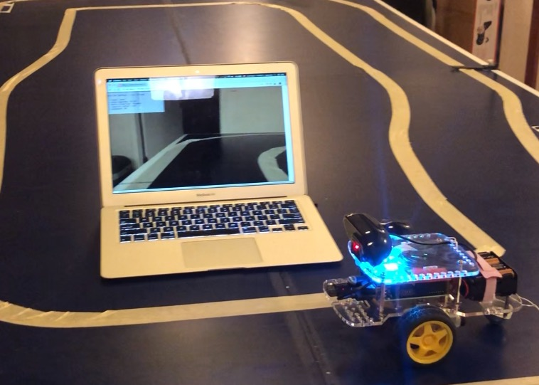
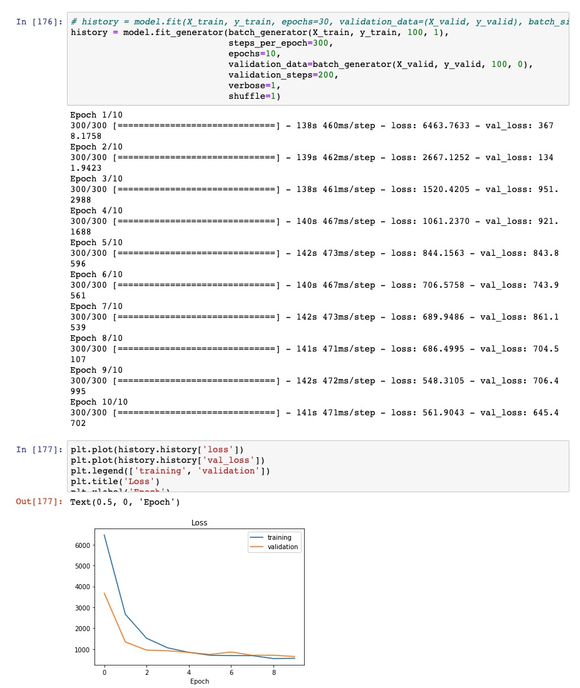

# 원격 조종 GoPiGo3를 기반으로 한 자율주행차 제작 Self-driving-go

이 프로젝트에서 우리는 모바일 기기나 노트북으로 GoPiGo3 자동차를 원격으로 조종합니다.
여기에 컴퓨터비전을 기반으로 한 자율주행차 제작을 위한
* 학습데이터 획득
* 딥러닝 학습
* 자율주행 시험주행
전과정을 담고 있습니다.



## 요구사항

이 프로젝트를 위해 필요한 것들입니다:

* [GoPiGo3](https://amzn.to/2KnbXhP) 로봇 키트.
* [Raspberry Pi](https://amzn.to/31l8rdi) 이미지 프로세싱, AI 엔진
* [Pi Camera](https://amzn.to/2GRT04K) 카메라 모듈.
* 노트북 혹은 스마트폰 (키보드 주행을 위해 노트북 선호).
* 인공지능 학습(딥러닝)을 위한 GPU 장착된 리눅스 컴퓨터

## 설정

1. GoPiGo3 설치 - `Raspbian For Robots` 설치 확인
2. 의존성 모듈 설치
 ```
 sudo pip3 install -r requirements.txt
 ```
3. TensorFlow 설치 - 뉴럴넷 inference용

## 실행

다음 명령을 입력합니다:
```
python3 remote_robot.py
```
플래스크 웹앱이 실행되는 라스베리 서버 주소를 브라우저에서 입력하면 카메라 화면을 볼 수 있고 주행이 준비된 상태입니다.

웹앱은 포트 5000으로 설정되어 있고 비디오 스트리밍은 5001로 설정되어 있습니다.

모든 파일이 웹앱이 위치한 폴더에 있어야 합니다.

## 훈련 데이터 생성
* 원래 제공된 마우스를 이용하지 않고 키보드를 사용해 주행하면서 이미지와 주행 방향 정보를 획득합니다.
* 방향키를 이용합니다.:
  * up - 전진
  * left - 좌회전
  * right - 우회전
  * space - 정지
  * q - 가속
  * w - 감속
  * p - 조명 켜기
  * o - 조명 끄기

## 데이터 준비
* 충분한 주행을 마친 후 훈련데이터는 `~/test/training`에 저장됩니다. 매번 새로 생성되기 때문에 주행마다 다음과 같이 tar 압축해줍니다.
* `tar cvzf training_left.tgz training/*`

## 딥러닝을 통한 뉴럴넷 학습
1. jupyter notebook을 실행하고,
2. self-driving-go.ipynb를 엽니다.
3. 코드를 따라 학습하면 `model.h5`파일을 얻게 됩니다.
4. 이 파일을 raspberry pi의 해당 폴더에 업로드합니다.



## 자율주행 시험
(자율주행이기 때문에 직접 조종할 필요는 없습니다. 하지만 예기치 못한 작동으로 인한 불의의 사고를 방지하기 위해 감시해야 합니다.

```
$ python3 self_driving_go.py
```
이 명령어를 실행하면, 컴퓨터 비전으로 입력된 정보와 학습된 주행방향으로 자율주행이 시작됩니다.

## YouTube Video

이 프로젝트를 소개한 유튜브 영상입니다:

[](https://youtu.be/jyg_nt28ktk)
